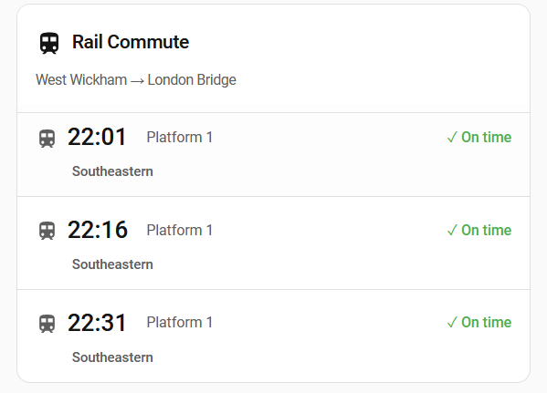

# CFL Commute Card

[](https://github.com/hacs/integration)
[](https://github.com/ogerardin/lovelace-cfl-commute-card/releases)
[](LICENSE)

A beautiful, feature-rich custom Lovelace card for Home Assistant that displays CFL (Luxembourg Railways) train departure information. Designed to work seamlessly with the [HACS CFL Commute](https://github.com/ogerardin/hacs-cfl-commute) integration.



## Features

- **Multiple View Modes**: Full, Compact, Next-Only, and Departure Board views
- **Beautiful Design**: Mimics real railway station departure boards
- **Theme Support**: Auto, Light, and Dark themes
- **Customizable**: Show/hide platform, operator, calling points, delay reasons
- **Disruption Alerts**: Banner showing service disruptions
- **Interactive**: Tap for more info, hold to refresh

## Requirements

- Home Assistant 2024.1.0 or higher
- [HACS CFL Commute](https://github.com/ogerardin/hacs-cfl-commute) integration installed

## Installation

### Via HACS (Recommended)

1. Open Home Assistant
2. Navigate to **HACS** → **Frontend**
3. Click the **+** button
4. Search for "CFL Commute Card"
5. Click **Install**
6. Refresh your browser (Ctrl+Shift+R or Cmd+Shift+R)

### Manual Installation

1. Download the latest `cfl-commute-card.js` from [Releases](https://github.com/ogerardin/lovelace-cfl-commute-card/releases)
2. Copy the file to `/config/www/cfl-commute-card.js`
3. Add to your `configuration.yaml`:

```yaml
resources:
  - url: /local/cfl-commute-card.js
    type: module
```

4. Restart Home Assistant

## Related Projects

- [HACS CFL Commute](https://github.com/ogerardin/hacs-cfl-commute) - The integration this card is designed for
- [lovelace-my-rail-commute-card](https://github.com/adamf83/lovelace-my-rail-commute-card) - The inspiration for this card (UK Rail version)

---

Made with ❤️ for the Home Assistant community
